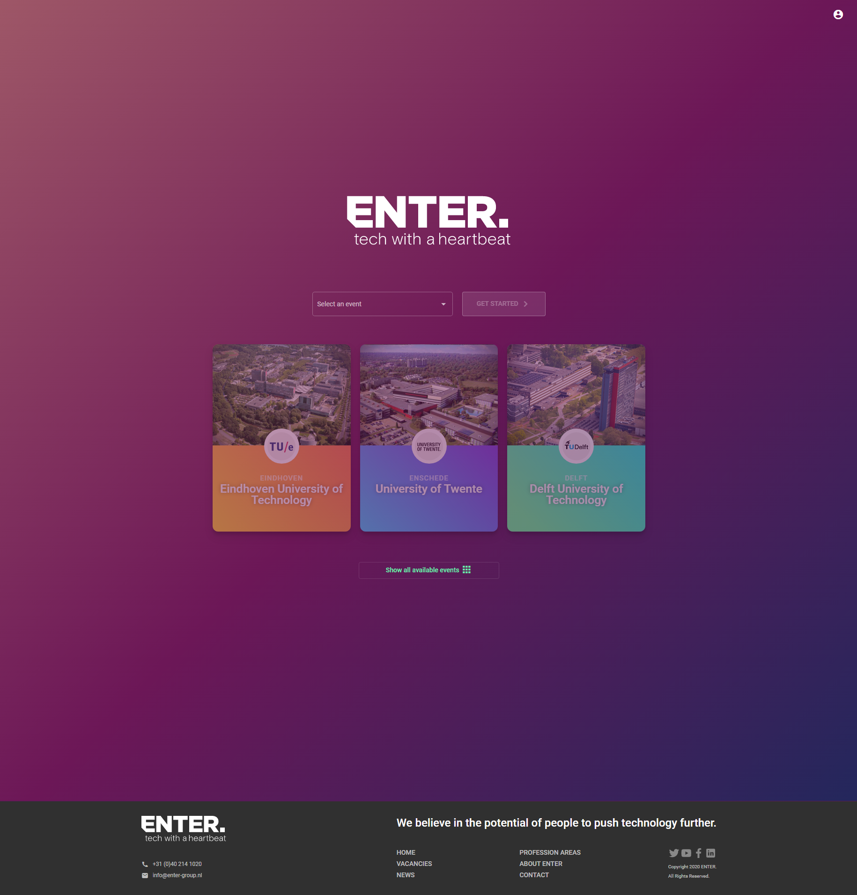
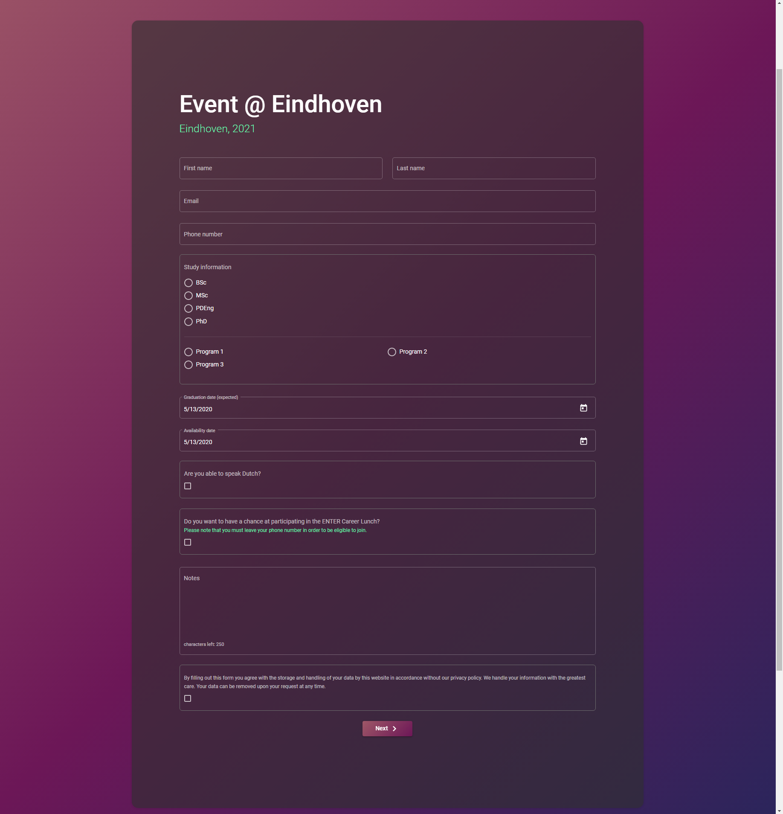
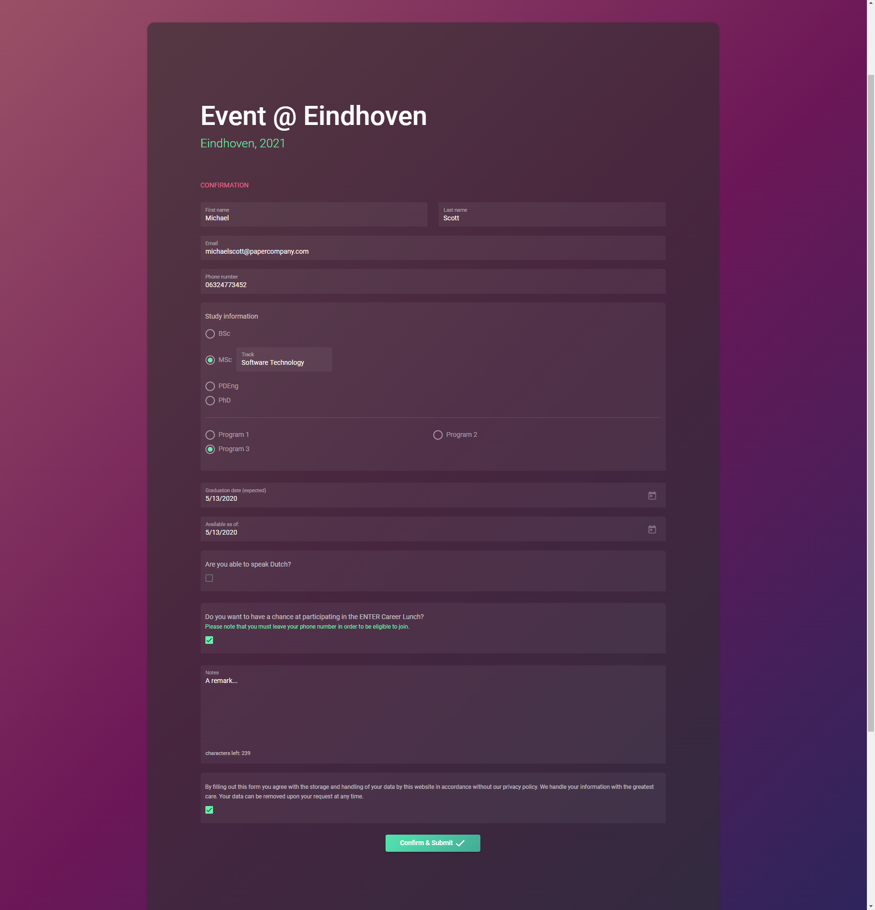
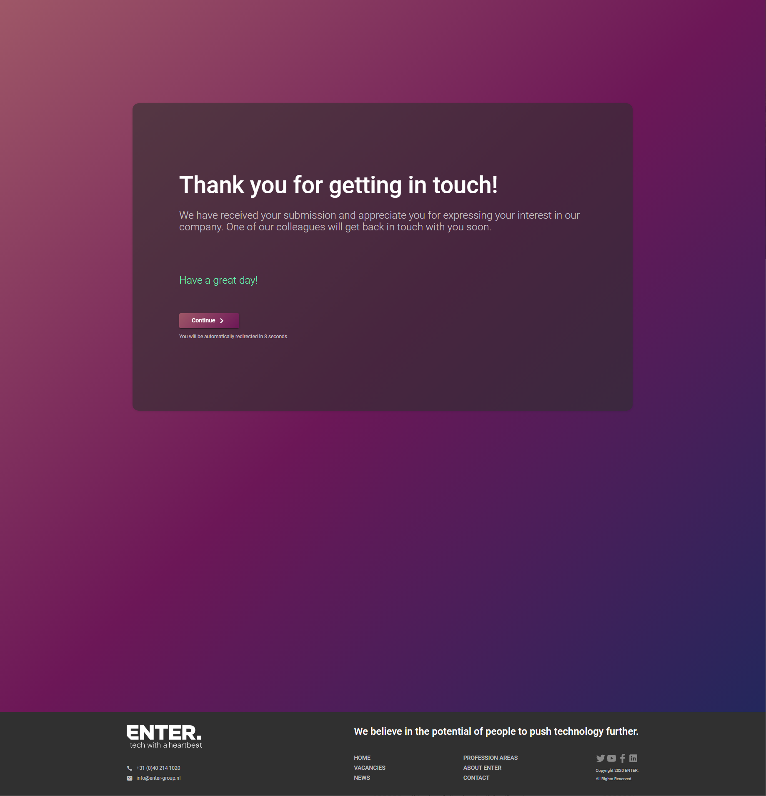
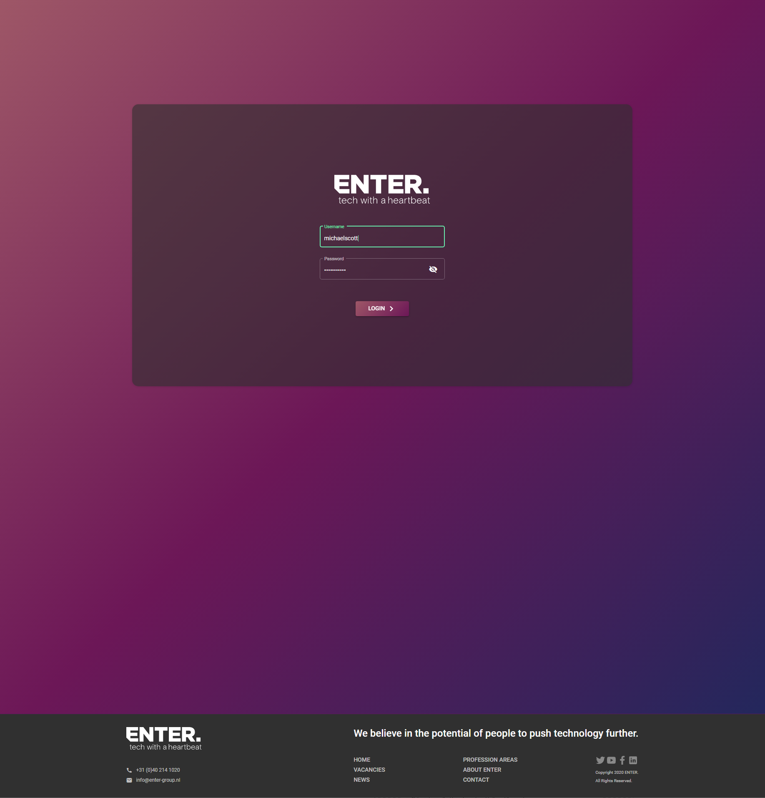
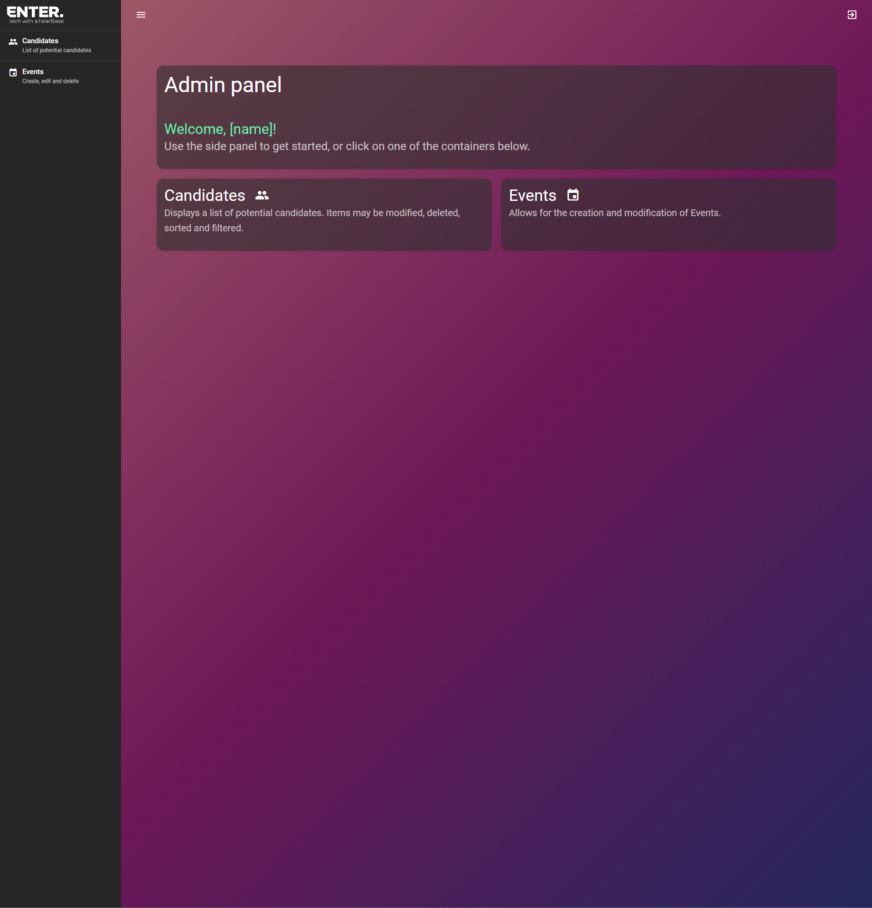
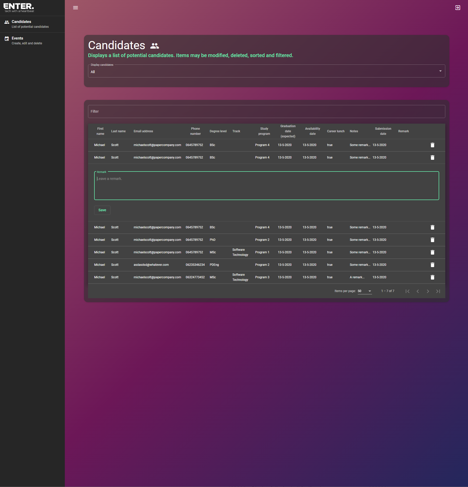
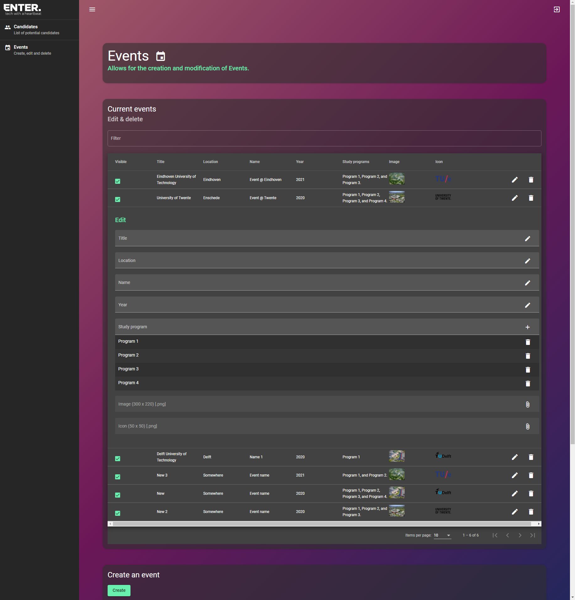

##### March 1, 2020

# ENTER-job-fair-app
Web-based job fair submission form for ENTER. The app allows for potential candidates to be easily categorized and recognized, and consists of a submission form and an admin panel.

`git clone https://github.com/JThissen/enter-job-fair-app.git`

## Setup development environment

To setup a development environment, install the following packages: 

* .NET Core: https://dotnet.microsoft.com/download/dotnet-core
* Visual Studio Code (the MIT-license version of Visual Studio): https://code.visualstudio.com/download
* PostgreSQL: https://www.enterprisedb.com/downloads/postgres-postgresql-downloads
** Apply the downloaded installer
** Enter your desired password
** Optionally using `pgadmin4` from the start menu, add a new user to be used for the application
* Angular: https://angular.io/guide/setup-local

After installing this, launch Visual Studio Code, and: 
* Checkout the github repository in Visual Studio: https://github.com/JThissen/enter-job-fair-app.git
* appsettings:
** Unfold appsettings.json to show appsettings.Development.json
** Update username and password in both files to your database.
* In a Visual Studio Code console, install Entity Framework: `dotnet tool install --global dotnet-ef`
* Restart Visual Studio Code
* Setup the database (make sure your current directory contains the .csproj file): `dotnet ef database update`
* Launch the web API using CTRL+F5.
* Lastly, head over to the enter-job-fair-form and launch the application using `ng serve --open`.

## GIF

## Screenshots

